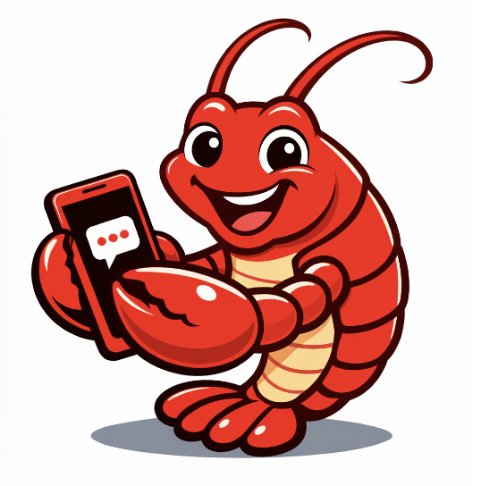

# Lobster Chat



An experimental mobile application exploring the possibility of creating a dedicated mobile app for [OpenClaw](https://github.com/openai/openclaw), following the same philosophy of running fully locally on your chosen machine as much as possible.

**Status:** As of January 2026, this is very much in an early explorative work-in-progress stage.

---

A full-stack mobile application project consisting of an Expo-based React Native mobile app and a Node.js backend server.

## Project Structure

This repository contains three main components:

### 📱 Mobile App (`/mobile-app`)
A React Native mobile application built with Expo, featuring:
- Drawer navigation
- Chat interface
- Settings management
- Cross-platform support (iOS, Android, Web)

[View Mobile App Documentation](./mobile-app/README.md)

### 🖥️ Server (`/server`)
A Node.js/Express backend API server providing:
- Session management endpoints
- Message handling for chat sessions
- RESTful API architecture
- CORS-enabled for mobile app integration

[View Server Documentation](./server/README.md)

### 🔌 OpenClaw Plugin (`/openclaw-plugins`)
An OpenClaw channel plugin that integrates the Lobster Chat server with OpenClaw:
- Custom channel registration (similar to WhatsApp/Telegram)
- Bidirectional message flow between OpenClaw and Lobster Chat
- Webhook integration for inbound messages
- Direct delivery for outbound messages

[View OpenClaw Plugin Documentation](./openclaw-plugins/README.md)

## Quick Start

### Prerequisites
- Node.js (v16 or higher)
- npm or yarn
- Expo Go app (for mobile testing)

### Running the Project

1. **Start the Server**
   ```bash
   cd server
   npm install
   npm start
   ```
   The server will run on `http://localhost:3000`

2. **Start the Mobile App**
   ```bash
   cd mobile-app
   npm install
   npm start
   ```
   Follow the Expo CLI instructions to run on your device or emulator

## Development

- The mobile app and server can be developed independently
- The server provides a REST API that the mobile app can consume
- Both projects have their own dependencies and can be run simultaneously

## Technologies

**Mobile App:**
- React Native
- Expo
- React Navigation

**Server:**
- Node.js
- Express.js
- CORS
- better-sqlite3

**OpenClaw Integration:**
- OpenClaw Plugin API
- Custom channel implementation
- Webhook-based messaging

## License

Private

